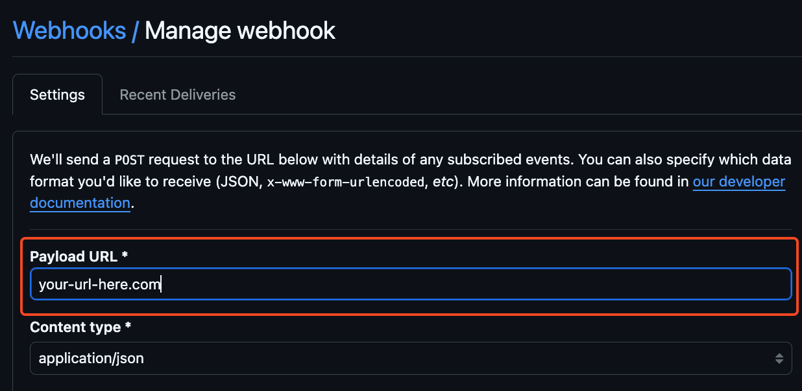

# GitHub Workflow Run Approver (Go Lambda) 🚀

<p align="center">
    
</p>

<p align="center">
    
</p>

## Description

This project is a Go-based AWS Lambda function designed to handle GitHub `workflow_run.requested` webhook [events](https://docs.github.com/en/webhooks/webhook-events-and-payloads?actionType=requested#workflow_run). When a `workflow_run.requested` event is received, it checks if the user has permission to get their run approved based on rules defined in a DynamoDB table. Approved runs are then initiated as per the access policies.

## Features

- **DynamoDB Access Control**: User permissions are managed in a DynamoDB table. Each entry includes:
  - **Sort Key**: `<repo>#<env>` to define repository and environment access levels.
  - **Partition Key**: The GitHub username, enabling flexible access rules (e.g., `*#*` for universal access, `<repo>#*` for all environments in a repo).
- **Concurrency**: Handles concurrent access checks for faster performance.
- **Structured Logging**: Uses Zap for structured JSON logging to improve observability and debugging.
- **Tracing**: X-Ray tracing for tracking requests across services.
- **Secrets Management**: Credentials and secrets are securely stored in AWS Secrets Manager and cached in memory to reduce the number of retrieval calls.
- **Infrastructure as Code (IaC)**: Entire project is defined with Terraform and Terragrunt for consistent, reproducible deployments.
- **API Gateway Security**: The Lambda is behind an API Gateway, restricted to only GitHub source IPs noted in the `api.github.com/meta` [endpoint](https://api.github.com/meta) in the `hooks` section.

## Prerequisites

- AWS Account with permissions to provision resources for Lambda, DynamoDB, Secrets Manager, X-Ray, and IAM roles.
- The [AWS CLI v2](https://docs.aws.amazon.com/cli/latest/userguide/getting-started-install.html) (to set up your [configured profile](https://docs.aws.amazon.com/cli/latest/userguide/cli-configure-files.html#cli-configure-files-format))
- GitHub webhook integration [set up](https://docs.github.com/en/webhooks/using-webhooks/creating-webhooks) for `workflow_run` [events](https://docs.github.com/en/webhooks/webhook-events-and-payloads?actionType=requested#workflow_run) - securely note your webhook secret and set a temp URL.
- [OpenTofu](https://opentofu.org/docs/intro/install/) and [Terragrunt](https://terragrunt.gruntwork.io/docs/getting-started/install/) installed.
- tenv for automatically managing OpenTofu

## Setup and Deployment

1.  **Clone the Repository**

    ```bash
    git clone <repository-url>
    cd <repository-directory>
    ```

2.  **Install the Required OpenTofu and Terragrunt Versions**

    ```bash
    tenv terragrunt install
    tenv opentofu install
    ```

3.  **Update configuration**

Terragrunt uses the profile defined as

```hcl
  profile        = "${local.project_name}-${local.environment}"
```

to tell AWS that profile should be used

```hcl
provider "aws" {
  region  = "${local.aws_region}"
  profile = "${local.profile}"
  ....
```

Update this to a value that works for you in [common.hcl](./terraform/configuration/common.hcl). You can learn more about Terragrunt [here](https://terragrunt.gruntwork.io/docs/getting-started/quick-start/) and the live infrastructure example [here](https://github.com/gruntwork-io/terragrunt-infrastructure-live-example) can be used to better understand how this repo's IaC is organized.

Update the AWS Account ID in [account.hcl](./terraform/configuration/us-west-2/dev/account.hcl) as well.

4. **Provide Secure Variables Using Environment Variables**

Terragrunt/Terraform can use environment variables to source variables - see more [here](https://developer.hashicorp.com/terraform/cli/config/environment-variables#tf_var_name).

```bash
export TF_VAR_github_PAT="github_pat_XXXX"
export TF_VAR_github_webhook_secret_string="reys_secret_string"
```

5. **Run Terragrunt and Allow It To Provision Resources**

```bash
cd /terraform/configuration/us-west-2/dev/applications
terragrunt run-all plan # confirm changes
terragrunt run-all apply # apply those changes
```

6. **Provide GitHub With Your Invoke URL**

Update the temporary URL for your webhook with your the invoke URL for your API Gateway. See how to get your API's invoke URL [here](https://docs.aws.amazon.com/apigateway/latest/developerguide/how-to-call-api.html#apigateway-how-to-call-rest-api).



7. **Set Up A Rule In Your DynamoDB Table**

Add an entry to your rules table to allow access. See more on adding an entry to DynamoDB [here](https://docs.aws.amazon.com/amazondynamodb/latest/developerguide/getting-started-step-2.html).

```bash
aws dynamodb put-item \
    --table-name <table_name>  \
    --profile <profile> \
    --item \
        '{"login": {"S": "<SAMPLE_GITHUB_USERNAME>"}, "repo-env": {"S": "<repo>#<env>"}}'
```

For example, this rule would give GitHub user `reywilliams` access to `my-env` in `my-repo`

```bash
aws dynamodb put-item \
    --table-name deployment-webhooks-table  \
    --profile webhooks-dev \
    --item \
        '{"login": {"S": "reywilliams"}, "repo-env": {"S": "my-repo#my-env"}}'
```

or

And this rule would give GitHub user `reywilliams` to have access to all environments (`*`) in `my-repo`

```bash
aws dynamodb put-item \
    --table-name deployment-webhooks-table  \
    --profile webhooks-dev \
    --item \
        '{"login": {"S": "reywilliams"}, "repo-env": {"S": "my-repo#*"}}'
```
